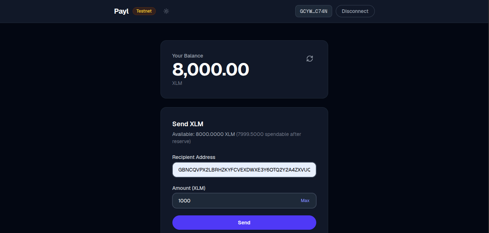
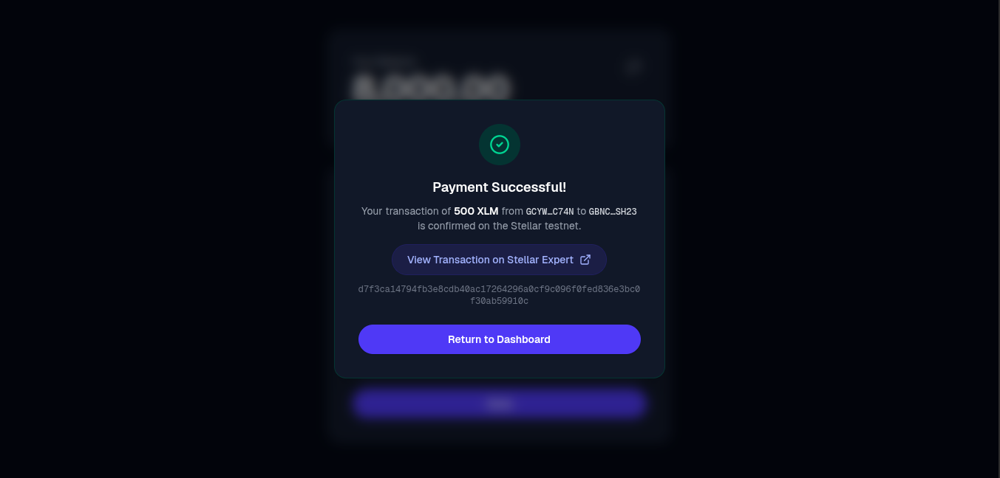
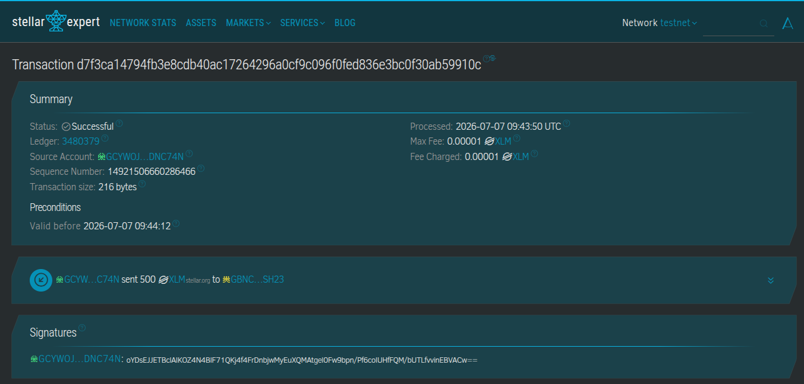

# Payl - Stellar Payment dApp

A PayPal-inspired payment dApp built on Stellar. Send XLM (the native Stellar asset) using the Freighter wallet extension.

## Features

- **Wallet Connection** - Connect via Freighter wallet with persistent state across page refreshes
- **Balance Display** - View your XLM balance with a clean, PayPal-like card UI
- **Friendbot Funding** - One-click account funding from the testnet faucet for new accounts
- **Send XLM** - Send payments with recipient validation, balance checks, and a "Max" shortcut
- **Transaction Status** - Real-time tx status tracking (building → awaiting signature → submitting → success/failed)
- **Stellar Expert Links** - Clickable transaction hash links to view on the testnet explorer
- **Comprehensive Error Handling** - Freighter not installed, connection/signing rejection, insufficient balance, invalid addresses, and more

## Tech Stack

- **Next.js 16** (App Router) + TypeScript
- **Tailwind CSS v4** for styling
- **@stellar/stellar-sdk** - Horizon API communication, transaction building
- **@stellar/freighter-api** - Wallet connection and transaction signing via Freighter
- **Stellar Testnet** - Horizon: `https://horizon-testnet.stellar.org`

## Local Setup

### Prerequisites

- Node.js 20.9+
- npm
- [Freighter Wallet](https://www.freighter.app/) browser extension

### Installation

```bash
git clone https://github.com/cybwithflourish/payl.git
cd payl
npm install
```

### Run Dev Server

```bash
npm run dev
```

Open [http://localhost:3000](http://localhost:3000) in your browser.

### Using Freighter

1. Install the [Freighter](https://www.freighter.app/) browser extension
2. Click the Freighter icon in your browser toolbar
3. Create a new wallet (or import an existing one)
4. Open Freighter settings and switch the network to **Testnet**
5. Refresh the Payl app and click "Connect Wallet"

## Deploy to Vercel

[](https://vercel.com/new)

No environment variables needed - all config is hardcoded for testnet.

## Project Structure

```
src/
├── app/
│   ├── globals.css        # Global styles, Tailwind imports
│   ├── layout.tsx         # Root layout with fonts and metadata
│   └── page.tsx           # Main single-page app
├── components/
│   ├── Header.tsx         # Payl logo, network badge, wallet button
│   ├── BalanceCard.tsx    # XLM balance display + Friendbot CTA
│   ├── SendForm.tsx       # Recipient + amount inputs with Send
│   └── TransactionResult.tsx  # Success/failure panel with tx link
├── hooks/
│   ├── useWallet.ts       # Connect/disconnect + key persistence
│   ├── useBalance.ts      # Fetch/refresh balance + Friendbot funding
│   └── useSendPayment.ts  # Build/sign/submit transaction flow
└── lib/
    └── stellar.ts          # SDK config, network constants, helpers
```

## Screenshots

### Wallet Connected - Balance Displayed



### Successful Testnet Transaction



### Transaction Result Shown



## Live Demo
NILL
